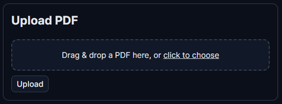

# AI Document Analyzer (MVP)

Upload PDFs, embed chunks with SentenceTransformers + FAISS, search them, and run free extractive QA (no paid APIs).

---

## Features

- PDF upload → text extraction (pdfplumber) → chunking  
- Embeddings: `all-MiniLM-L6-v2` (SentenceTransformers)  
- Vector DB: FAISS (with disk persistence)  
- Search: `/search`  
- QA (free, local): `/query` using `deepset/roberta-base-squad2`  
- Health & Stats: `/health`, `/stats`  
- Auto-load/save index on startup/shutdown  

---

## Quickstart

```bash
# Create venv
python -m venv venv

# Activate venv
# Windows:
venv\Scripts\activate
# macOS/Linux:
# source venv/bin/activate

# Install dependencies
pip install -r requirements.txt

# Run the server
uvicorn app.main:app --reload
```

Open Swagger UI: [http://127.0.0.1:8000/docs](http://127.0.0.1:8000/docs)

---

## Screenshots
Here is a quick look at the app in action:
### Upload



### Ask a Question


### Answer with Sources


## Example Usage

### Upload a PDF
```bash
curl -X POST http://127.0.0.1:8000/upload-pdf   -H "Content-Type: multipart/form-data"   -F "file=@/path/to/your.pdf"
```

### Search
```bash
curl -X POST http://127.0.0.1:8000/search   -H "Content-Type: application/json"   -d "{\"query\":\"your question\",\"top_k\":3}"
```

### QA
```bash
curl -X POST http://127.0.0.1:8000/query   -H "Content-Type: application/json"   -d "{\"query\":\"your question\",\"top_k\":3}"
```

---

## Project Structure

```
app/
  main.py          # FastAPI app & endpoints
  models.py        # Pydantic schemas
  utils.py         # PDF extract + chunk helpers
  embeddings.py    # SentenceTransformer + FAISS + persistence
  qa.py            # Free extractive QA pipeline
uploads/            # (runtime) temporary files
index.faiss         # (runtime) FAISS index
metadata.json       # (runtime) metadata store
```

---

## Notes

- Data persists via `index.faiss` and `metadata.json`.  
- Free QA via `deepset/roberta-base-squad2`. No OpenAI key needed.  
- If you change metadata shape, delete `index.faiss` and `metadata.json` and re-upload.  

---
